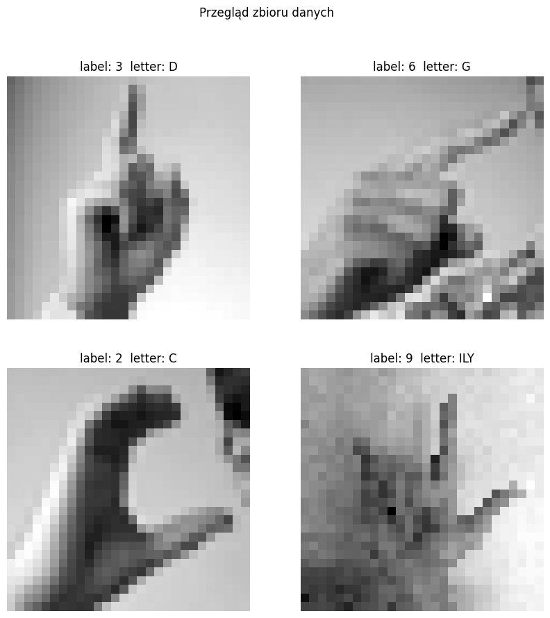
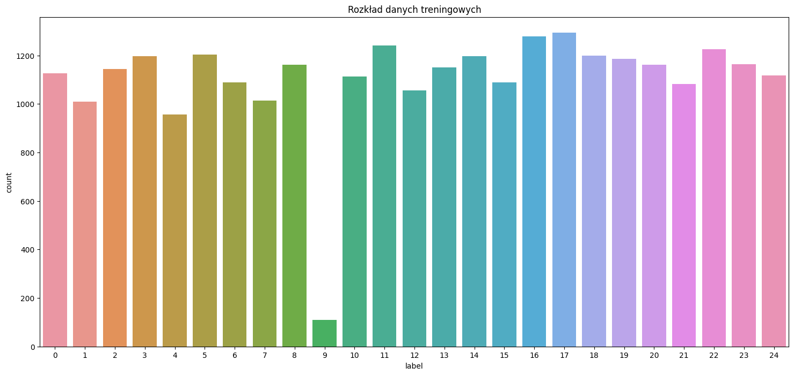
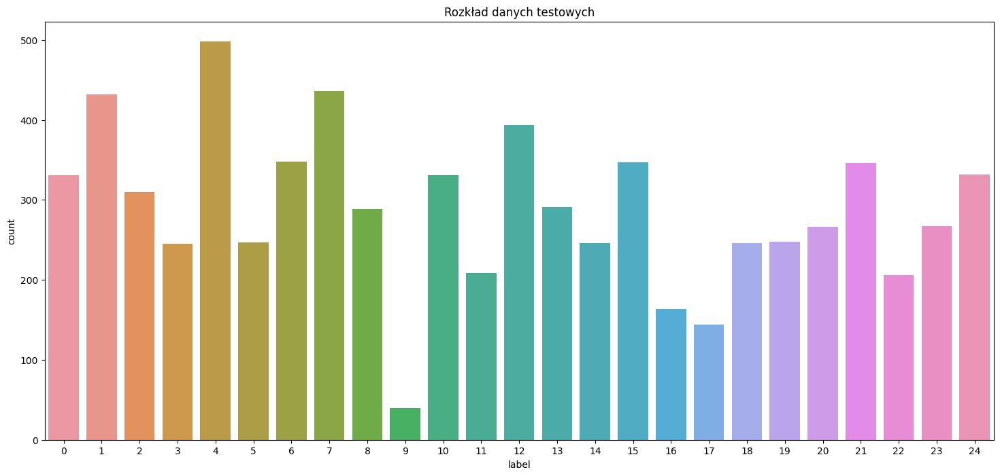
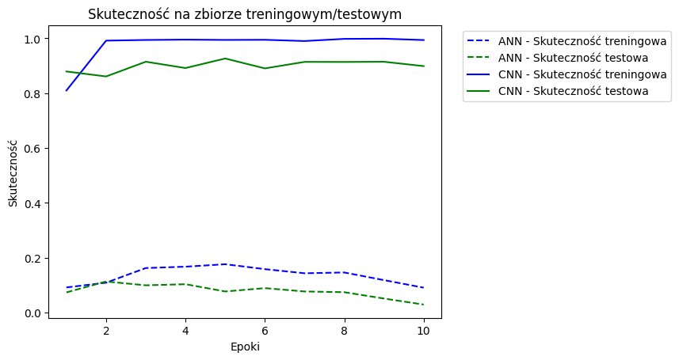
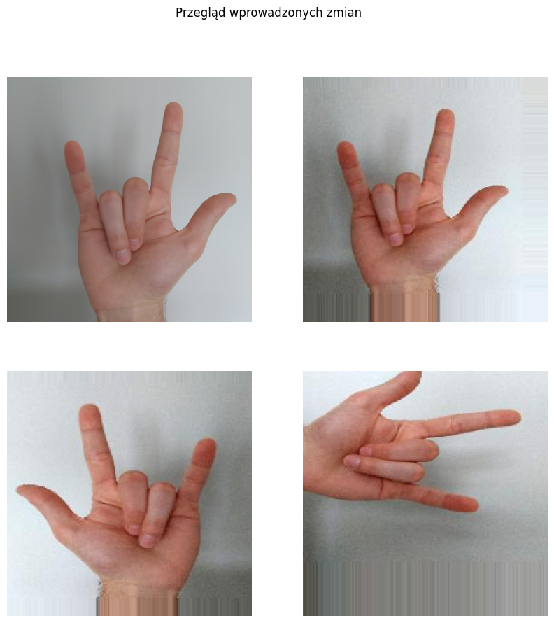
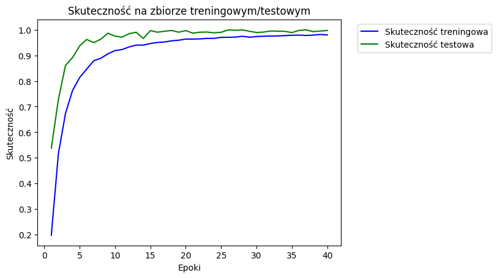
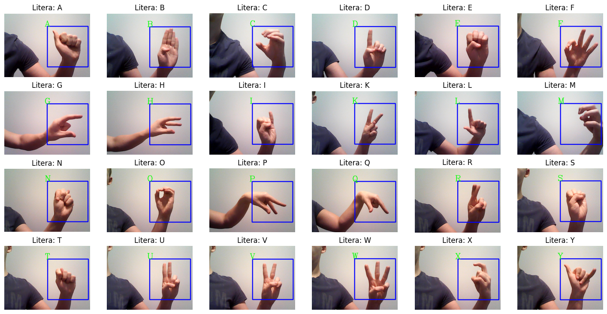

<h1><center>Sign Language Detection</center></h1>
<h2><center>Deep Neural Networks</center></h2>
<h3><center>PL</center></h3>

Celem naszego projektu jest stworzenie głębokiej sieci neuronowej służacej do rozpoznawania liter języka migowego. W tym celu wykorzystaliśmy zbiór danych dostępny na stronie kaggle.com. Posiada on ponad 27 tysięcy obrazów treningowych oraz 7 tysięcy obrazów testowych zapisanych do pliku csv. Każde zdjęcie składa się z 784 pikseli (28x28) reprezentowanych w skali szarości z zakesu 0-255.

Zbiór danych posiada 24 klasy odpowiadające poszczególnym literom alfabetu. W projekcie nie uwzględniamy litery "J" oraz "Z", ponieważ zasada ich wizualizacji polega na dynamicznym ruchu ręką.

### Wykorzystywane litery języka migowego:


###  Importowanie bibliotek


```python
import numpy as np
import cv2
import pandas as pd
import tensorflow as tf
import scipy
import os
from keras.models import Sequential
from keras.layers import Dense,Flatten,Conv2D,MaxPool2D,Dropout
import matplotlib.pyplot as plt
import seaborn as sns
from sklearn.preprocessing import LabelBinarizer
from keras.preprocessing.image import ImageDataGenerator
import warnings
warnings.filterwarnings('ignore')
```

### 1. Pobranie zbioru danych
Na początku pobieramy dane z plików csv. Wszystkie obrazy mają 785 kolumn danych, gdzie pierwsza z nich odpowiada za etykietę, zaś wszystkie kolejne to wartości pikseli.


```python
train_df=pd.read_csv('kaggle\sign_mnist_train.csv')
test_df=pd.read_csv('kaggle\sign_mnist_test.csv')
```


```python
pd.set_option('display.max_columns', 16)
```


```python
train_df
```


<div>
<style scoped>
    .dataframe tbody tr th:only-of-type {
        vertical-align: middle;
    }

    .dataframe tbody tr th {
        vertical-align: top;
    }

    .dataframe thead th {
        text-align: right;
    }
</style>
<table border="1" class="dataframe">
  <thead>
    <tr style="text-align: right;">
      <th></th>
      <th>label</th>
      <th>pixel1</th>
      <th>pixel2</th>
      <th>pixel3</th>
      <th>pixel4</th>
      <th>pixel5</th>
      <th>pixel6</th>
      <th>pixel7</th>
      <th>...</th>
      <th>pixel777</th>
      <th>pixel778</th>
      <th>pixel779</th>
      <th>pixel780</th>
      <th>pixel781</th>
      <th>pixel782</th>
      <th>pixel783</th>
      <th>pixel784</th>
    </tr>
  </thead>
  <tbody>
    <tr>
      <th>0</th>
      <td>3</td>
      <td>107</td>
      <td>118</td>
      <td>127</td>
      <td>134</td>
      <td>139</td>
      <td>143</td>
      <td>146</td>
      <td>...</td>
      <td>207</td>
      <td>207</td>
      <td>206</td>
      <td>206</td>
      <td>206</td>
      <td>204</td>
      <td>203</td>
      <td>202</td>
    </tr>
    <tr>
      <th>1</th>
      <td>6</td>
      <td>155</td>
      <td>157</td>
      <td>156</td>
      <td>156</td>
      <td>156</td>
      <td>157</td>
      <td>156</td>
      <td>...</td>
      <td>128</td>
      <td>87</td>
      <td>94</td>
      <td>163</td>
      <td>175</td>
      <td>103</td>
      <td>135</td>
      <td>149</td>
    </tr>
    <tr>
      <th>2</th>
      <td>2</td>
      <td>187</td>
      <td>188</td>
      <td>188</td>
      <td>187</td>
      <td>187</td>
      <td>186</td>
      <td>187</td>
      <td>...</td>
      <td>200</td>
      <td>199</td>
      <td>198</td>
      <td>199</td>
      <td>198</td>
      <td>195</td>
      <td>194</td>
      <td>195</td>
    </tr>
    <tr>
      <th>3</th>
      <td>2</td>
      <td>211</td>
      <td>211</td>
      <td>212</td>
      <td>212</td>
      <td>211</td>
      <td>210</td>
      <td>211</td>
      <td>...</td>
      <td>233</td>
      <td>231</td>
      <td>230</td>
      <td>226</td>
      <td>225</td>
      <td>222</td>
      <td>229</td>
      <td>163</td>
    </tr>
    <tr>
      <th>4</th>
      <td>13</td>
      <td>164</td>
      <td>167</td>
      <td>170</td>
      <td>172</td>
      <td>176</td>
      <td>179</td>
      <td>180</td>
      <td>...</td>
      <td>105</td>
      <td>108</td>
      <td>133</td>
      <td>163</td>
      <td>157</td>
      <td>163</td>
      <td>164</td>
      <td>179</td>
    </tr>
    <tr>
      <th>...</th>
      <td>...</td>
      <td>...</td>
      <td>...</td>
      <td>...</td>
      <td>...</td>
      <td>...</td>
      <td>...</td>
      <td>...</td>
      <td>...</td>
      <td>...</td>
      <td>...</td>
      <td>...</td>
      <td>...</td>
      <td>...</td>
      <td>...</td>
      <td>...</td>
      <td>...</td>
    </tr>
    <tr>
      <th>27450</th>
      <td>13</td>
      <td>189</td>
      <td>189</td>
      <td>190</td>
      <td>190</td>
      <td>192</td>
      <td>193</td>
      <td>193</td>
      <td>...</td>
      <td>99</td>
      <td>77</td>
      <td>52</td>
      <td>200</td>
      <td>234</td>
      <td>200</td>
      <td>222</td>
      <td>225</td>
    </tr>
    <tr>
      <th>27451</th>
      <td>23</td>
      <td>151</td>
      <td>154</td>
      <td>157</td>
      <td>158</td>
      <td>160</td>
      <td>161</td>
      <td>163</td>
      <td>...</td>
      <td>198</td>
      <td>198</td>
      <td>198</td>
      <td>196</td>
      <td>195</td>
      <td>195</td>
      <td>195</td>
      <td>194</td>
    </tr>
    <tr>
      <th>27452</th>
      <td>18</td>
      <td>174</td>
      <td>174</td>
      <td>174</td>
      <td>174</td>
      <td>174</td>
      <td>175</td>
      <td>175</td>
      <td>...</td>
      <td>209</td>
      <td>208</td>
      <td>206</td>
      <td>204</td>
      <td>203</td>
      <td>202</td>
      <td>200</td>
      <td>200</td>
    </tr>
    <tr>
      <th>27453</th>
      <td>17</td>
      <td>177</td>
      <td>181</td>
      <td>184</td>
      <td>185</td>
      <td>187</td>
      <td>189</td>
      <td>190</td>
      <td>...</td>
      <td>27</td>
      <td>58</td>
      <td>102</td>
      <td>79</td>
      <td>47</td>
      <td>64</td>
      <td>87</td>
      <td>93</td>
    </tr>
    <tr>
      <th>27454</th>
      <td>23</td>
      <td>179</td>
      <td>180</td>
      <td>180</td>
      <td>180</td>
      <td>182</td>
      <td>181</td>
      <td>182</td>
      <td>...</td>
      <td>170</td>
      <td>194</td>
      <td>214</td>
      <td>203</td>
      <td>197</td>
      <td>205</td>
      <td>209</td>
      <td>215</td>
    </tr>
  </tbody>
</table>
<p>27455 rows × 785 columns</p>
</div>


Etykiety naszego zbioru to liczby od 0 do 24 z pominięciem cyfry 9 odpowiedzialnej za nieuwzględnianą w projekcie literę "J".


```python
df = train_df.iloc[:,0]
print(df.unique())
```

    [ 3  6  2 13 16  8 22 18 10 20 17 19 21 23 24  1 12 11 15  4  0  5  7 14]
    

### 2. Dodanie własnego znaku
Po załadowaniu zbioru danych przechodzimy do powiększenia go o nowy znak symbolizujący powiedzenie "I Love You". W tym celu wykonaliśmy 150 zdjęć naszych dłoni ułożonych w ten sam sposób. Nowe obrazu dzielimy w taki sposób by 110 z nich należało do zbioru treningowego, a 40 do testowego. Wszystkie zdjęcia konwertujemy do skali szarości oraz rozmiaru odpowiadającemu pozastałym danym. Jako etykiete wykorzystujemy brakującą cyfrę 9.

# 


```python
def addDataToSet(path_folder, label_):
    i = 0
    path = os.path.join(path_folder)
    rows = len(os.listdir(path))
    finalImageList = np.zeros(shape=(rows,785))
    while i < len(os.listdir(path)):
        for img in os.listdir(path):
            img_array = cv2.imread(os.path.join(path, img))
            img_array = cv2.cvtColor(img_array, cv2.COLOR_BGR2GRAY)
            img_array = scipy.ndimage.zoom(img_array,1/124)
            img_array = img_array.reshape((1,784))
            img_array = np.insert(img_array, 0, int(label_), axis=1) # label
            img_array = np.around(img_array,decimals=0)
            img_array = img_array.astype(int)
            finalImageList[i] = (img_array)
            i+=1
    return finalImageList
```

Dodanie zdjęć treningowych:


```python
Datadirectory = "ILY"
label = 9
df = pd.DataFrame(addDataToSet(Datadirectory,label))
df = df.add_prefix('pixel')
df.rename(columns={list(df)[0]: 'label'}, inplace=True)
train_df = train_df.append(df, ignore_index=True)
```

Dodanie zdjęć testowych:


```python
Datadirectory = "ILY_TEST"
label = 9
df = pd.DataFrame(addDataToSet(Datadirectory,label))
df = df.add_prefix('pixel')
df.rename(columns={list(df)[0]: 'label'}, inplace=True)
test_df = test_df.append(df, ignore_index=True)
```


```python
train_df.info()
```

    <class 'pandas.core.frame.DataFrame'>
    RangeIndex: 27565 entries, 0 to 27564
    Columns: 785 entries, label to pixel784
    dtypes: float64(785)
    memory usage: 165.1 MB
    


```python
test_df.info()
```

    <class 'pandas.core.frame.DataFrame'>
    RangeIndex: 7212 entries, 0 to 7211
    Columns: 785 entries, label to pixel784
    dtypes: float64(785)
    memory usage: 43.2 MB
    


```python
for col in train_df:
    train_df[col] = train_df[col].astype('int')
    test_df[col] = test_df[col].astype('int')
```


```python
train_df
```


<div>
<style scoped>
    .dataframe tbody tr th:only-of-type {
        vertical-align: middle;
    }

    .dataframe tbody tr th {
        vertical-align: top;
    }

    .dataframe thead th {
        text-align: right;
    }
</style>
<table border="1" class="dataframe">
  <thead>
    <tr style="text-align: right;">
      <th></th>
      <th>label</th>
      <th>pixel1</th>
      <th>pixel2</th>
      <th>pixel3</th>
      <th>pixel4</th>
      <th>pixel5</th>
      <th>pixel6</th>
      <th>pixel7</th>
      <th>...</th>
      <th>pixel777</th>
      <th>pixel778</th>
      <th>pixel779</th>
      <th>pixel780</th>
      <th>pixel781</th>
      <th>pixel782</th>
      <th>pixel783</th>
      <th>pixel784</th>
    </tr>
  </thead>
  <tbody>
    <tr>
      <th>0</th>
      <td>3</td>
      <td>107</td>
      <td>118</td>
      <td>127</td>
      <td>134</td>
      <td>139</td>
      <td>143</td>
      <td>146</td>
      <td>...</td>
      <td>207</td>
      <td>207</td>
      <td>206</td>
      <td>206</td>
      <td>206</td>
      <td>204</td>
      <td>203</td>
      <td>202</td>
    </tr>
    <tr>
      <th>1</th>
      <td>6</td>
      <td>155</td>
      <td>157</td>
      <td>156</td>
      <td>156</td>
      <td>156</td>
      <td>157</td>
      <td>156</td>
      <td>...</td>
      <td>128</td>
      <td>87</td>
      <td>94</td>
      <td>163</td>
      <td>175</td>
      <td>103</td>
      <td>135</td>
      <td>149</td>
    </tr>
    <tr>
      <th>2</th>
      <td>2</td>
      <td>187</td>
      <td>188</td>
      <td>188</td>
      <td>187</td>
      <td>187</td>
      <td>186</td>
      <td>187</td>
      <td>...</td>
      <td>200</td>
      <td>199</td>
      <td>198</td>
      <td>199</td>
      <td>198</td>
      <td>195</td>
      <td>194</td>
      <td>195</td>
    </tr>
    <tr>
      <th>3</th>
      <td>2</td>
      <td>211</td>
      <td>211</td>
      <td>212</td>
      <td>212</td>
      <td>211</td>
      <td>210</td>
      <td>211</td>
      <td>...</td>
      <td>233</td>
      <td>231</td>
      <td>230</td>
      <td>226</td>
      <td>225</td>
      <td>222</td>
      <td>229</td>
      <td>163</td>
    </tr>
    <tr>
      <th>4</th>
      <td>13</td>
      <td>164</td>
      <td>167</td>
      <td>170</td>
      <td>172</td>
      <td>176</td>
      <td>179</td>
      <td>180</td>
      <td>...</td>
      <td>105</td>
      <td>108</td>
      <td>133</td>
      <td>163</td>
      <td>157</td>
      <td>163</td>
      <td>164</td>
      <td>179</td>
    </tr>
    <tr>
      <th>...</th>
      <td>...</td>
      <td>...</td>
      <td>...</td>
      <td>...</td>
      <td>...</td>
      <td>...</td>
      <td>...</td>
      <td>...</td>
      <td>...</td>
      <td>...</td>
      <td>...</td>
      <td>...</td>
      <td>...</td>
      <td>...</td>
      <td>...</td>
      <td>...</td>
      <td>...</td>
    </tr>
    <tr>
      <th>27560</th>
      <td>9</td>
      <td>149</td>
      <td>150</td>
      <td>149</td>
      <td>143</td>
      <td>151</td>
      <td>151</td>
      <td>156</td>
      <td>...</td>
      <td>190</td>
      <td>194</td>
      <td>198</td>
      <td>202</td>
      <td>201</td>
      <td>202</td>
      <td>204</td>
      <td>210</td>
    </tr>
    <tr>
      <th>27561</th>
      <td>9</td>
      <td>148</td>
      <td>149</td>
      <td>146</td>
      <td>150</td>
      <td>146</td>
      <td>152</td>
      <td>156</td>
      <td>...</td>
      <td>189</td>
      <td>194</td>
      <td>201</td>
      <td>201</td>
      <td>205</td>
      <td>204</td>
      <td>207</td>
      <td>214</td>
    </tr>
    <tr>
      <th>27562</th>
      <td>9</td>
      <td>147</td>
      <td>151</td>
      <td>141</td>
      <td>153</td>
      <td>146</td>
      <td>146</td>
      <td>154</td>
      <td>...</td>
      <td>191</td>
      <td>192</td>
      <td>199</td>
      <td>201</td>
      <td>207</td>
      <td>203</td>
      <td>207</td>
      <td>207</td>
    </tr>
    <tr>
      <th>27563</th>
      <td>9</td>
      <td>143</td>
      <td>150</td>
      <td>147</td>
      <td>147</td>
      <td>140</td>
      <td>145</td>
      <td>157</td>
      <td>...</td>
      <td>185</td>
      <td>195</td>
      <td>199</td>
      <td>204</td>
      <td>203</td>
      <td>207</td>
      <td>207</td>
      <td>206</td>
    </tr>
    <tr>
      <th>27564</th>
      <td>9</td>
      <td>147</td>
      <td>152</td>
      <td>148</td>
      <td>150</td>
      <td>148</td>
      <td>152</td>
      <td>152</td>
      <td>...</td>
      <td>201</td>
      <td>203</td>
      <td>205</td>
      <td>208</td>
      <td>209</td>
      <td>215</td>
      <td>219</td>
      <td>221</td>
    </tr>
  </tbody>
</table>
<p>27565 rows × 785 columns</p>
</div>


```python
df = train_df.iloc[: , :10]
df.describe()
```


<div>
<style scoped>
    .dataframe tbody tr th:only-of-type {
        vertical-align: middle;
    }

    .dataframe tbody tr th {
        vertical-align: top;
    }

    .dataframe thead th {
        text-align: right;
    }
</style>
<table border="1" class="dataframe">
  <thead>
    <tr style="text-align: right;">
      <th></th>
      <th>label</th>
      <th>pixel1</th>
      <th>pixel2</th>
      <th>pixel3</th>
      <th>pixel4</th>
      <th>pixel5</th>
      <th>pixel6</th>
      <th>pixel7</th>
      <th>pixel8</th>
      <th>pixel9</th>
    </tr>
  </thead>
  <tbody>
    <tr>
      <th>count</th>
      <td>27565.000000</td>
      <td>27565.000000</td>
      <td>27565.000000</td>
      <td>27565.000000</td>
      <td>27565.000000</td>
      <td>27565.000000</td>
      <td>27565.000000</td>
      <td>27565.000000</td>
      <td>27565.000000</td>
      <td>27565.000000</td>
    </tr>
    <tr>
      <th>mean</th>
      <td>12.305569</td>
      <td>145.440305</td>
      <td>148.521386</td>
      <td>151.258698</td>
      <td>153.547361</td>
      <td>156.192563</td>
      <td>158.383530</td>
      <td>160.450245</td>
      <td>162.319064</td>
      <td>163.943007</td>
    </tr>
    <tr>
      <th>std</th>
      <td>7.276005</td>
      <td>41.280156</td>
      <td>39.866216</td>
      <td>38.981066</td>
      <td>38.519907</td>
      <td>37.040017</td>
      <td>36.057458</td>
      <td>34.949239</td>
      <td>33.597349</td>
      <td>32.587808</td>
    </tr>
    <tr>
      <th>min</th>
      <td>0.000000</td>
      <td>0.000000</td>
      <td>0.000000</td>
      <td>0.000000</td>
      <td>0.000000</td>
      <td>0.000000</td>
      <td>0.000000</td>
      <td>0.000000</td>
      <td>0.000000</td>
      <td>0.000000</td>
    </tr>
    <tr>
      <th>25%</th>
      <td>6.000000</td>
      <td>122.000000</td>
      <td>126.000000</td>
      <td>130.000000</td>
      <td>133.000000</td>
      <td>137.000000</td>
      <td>140.000000</td>
      <td>142.000000</td>
      <td>145.000000</td>
      <td>146.000000</td>
    </tr>
    <tr>
      <th>50%</th>
      <td>13.000000</td>
      <td>150.000000</td>
      <td>153.000000</td>
      <td>156.000000</td>
      <td>158.000000</td>
      <td>160.000000</td>
      <td>162.000000</td>
      <td>163.000000</td>
      <td>165.000000</td>
      <td>166.000000</td>
    </tr>
    <tr>
      <th>75%</th>
      <td>19.000000</td>
      <td>174.000000</td>
      <td>176.000000</td>
      <td>178.000000</td>
      <td>179.000000</td>
      <td>181.000000</td>
      <td>182.000000</td>
      <td>183.000000</td>
      <td>184.000000</td>
      <td>185.000000</td>
    </tr>
    <tr>
      <th>max</th>
      <td>24.000000</td>
      <td>255.000000</td>
      <td>255.000000</td>
      <td>255.000000</td>
      <td>255.000000</td>
      <td>255.000000</td>
      <td>255.000000</td>
      <td>255.000000</td>
      <td>255.000000</td>
      <td>255.000000</td>
    </tr>
  </tbody>
</table>
</div>


### 3. Konwertowanie danych
Kolejnym krokiem jest przekonwertowanie danych do formy wymaganej na wejściu sieci neuronowej. W tym celu oddzielamy etykiety od obrazków do osobnych dataframów. Następnie zmieniamy jednowymiarowy ciąg pikseli na macierz o wymiarze 28x28 (przejście z 1D na 3D). 


```python
train_label=train_df['label']
trainset=train_df.drop(['label'],axis=1)
trainset.head()
```


<div>
<style scoped>
    .dataframe tbody tr th:only-of-type {
        vertical-align: middle;
    }

    .dataframe tbody tr th {
        vertical-align: top;
    }

    .dataframe thead th {
        text-align: right;
    }
</style>
<table border="1" class="dataframe">
  <thead>
    <tr style="text-align: right;">
      <th></th>
      <th>pixel1</th>
      <th>pixel2</th>
      <th>pixel3</th>
      <th>pixel4</th>
      <th>pixel5</th>
      <th>pixel6</th>
      <th>pixel7</th>
      <th>pixel8</th>
      <th>...</th>
      <th>pixel777</th>
      <th>pixel778</th>
      <th>pixel779</th>
      <th>pixel780</th>
      <th>pixel781</th>
      <th>pixel782</th>
      <th>pixel783</th>
      <th>pixel784</th>
    </tr>
  </thead>
  <tbody>
    <tr>
      <th>0</th>
      <td>107</td>
      <td>118</td>
      <td>127</td>
      <td>134</td>
      <td>139</td>
      <td>143</td>
      <td>146</td>
      <td>150</td>
      <td>...</td>
      <td>207</td>
      <td>207</td>
      <td>206</td>
      <td>206</td>
      <td>206</td>
      <td>204</td>
      <td>203</td>
      <td>202</td>
    </tr>
    <tr>
      <th>1</th>
      <td>155</td>
      <td>157</td>
      <td>156</td>
      <td>156</td>
      <td>156</td>
      <td>157</td>
      <td>156</td>
      <td>158</td>
      <td>...</td>
      <td>128</td>
      <td>87</td>
      <td>94</td>
      <td>163</td>
      <td>175</td>
      <td>103</td>
      <td>135</td>
      <td>149</td>
    </tr>
    <tr>
      <th>2</th>
      <td>187</td>
      <td>188</td>
      <td>188</td>
      <td>187</td>
      <td>187</td>
      <td>186</td>
      <td>187</td>
      <td>188</td>
      <td>...</td>
      <td>200</td>
      <td>199</td>
      <td>198</td>
      <td>199</td>
      <td>198</td>
      <td>195</td>
      <td>194</td>
      <td>195</td>
    </tr>
    <tr>
      <th>3</th>
      <td>211</td>
      <td>211</td>
      <td>212</td>
      <td>212</td>
      <td>211</td>
      <td>210</td>
      <td>211</td>
      <td>210</td>
      <td>...</td>
      <td>233</td>
      <td>231</td>
      <td>230</td>
      <td>226</td>
      <td>225</td>
      <td>222</td>
      <td>229</td>
      <td>163</td>
    </tr>
    <tr>
      <th>4</th>
      <td>164</td>
      <td>167</td>
      <td>170</td>
      <td>172</td>
      <td>176</td>
      <td>179</td>
      <td>180</td>
      <td>184</td>
      <td>...</td>
      <td>105</td>
      <td>108</td>
      <td>133</td>
      <td>163</td>
      <td>157</td>
      <td>163</td>
      <td>164</td>
      <td>179</td>
    </tr>
  </tbody>
</table>
<p>5 rows × 784 columns</p>
</div>


```python
X_train = trainset.values
X_train = trainset.values.reshape(-1,28,28,1)
print(X_train.shape)
```

    (27565, 28, 28, 1)
    


```python
test_label=test_df['label']
X_test=test_df.drop(['label'],axis=1)
X_test=X_test.values.reshape(-1,28,28,1)
print(X_test.shape)
```

    (7212, 28, 28, 1)
    

Dotychczaswo nasze etykiety miały formę kolejnych liczb naturalnych od 0 do 24. Należy przetransformować je do zmiennych kategorycznych będących binarnym zapisem naszych danych (one-hot encoding). Od teraz każda etykieta przybierze postać ciagu 25 liczb, gdzie tylko jedna z nich będzie równa 1, zaś reszta to 0. Numer miejsca, w którym zapisana zostanie cyfra 1, oznaczać będzie klasę zdjęcia, np. jeśli y = 4, to tablica = [0 0 0 1 0 0.....0].


```python
lb=LabelBinarizer()
y_train=lb.fit_transform(train_label)
y_test=lb.fit_transform(test_label)
y_train
```


    array([[0, 0, 0, ..., 0, 0, 0],
           [0, 0, 0, ..., 0, 0, 0],
           [0, 0, 1, ..., 0, 0, 0],
           ...,
           [0, 0, 0, ..., 0, 0, 0],
           [0, 0, 0, ..., 0, 0, 0],
           [0, 0, 0, ..., 0, 0, 0]])


Ostateczne rozmiary przygotowanych zbiorów:


```python
print(X_train.shape,y_train.shape,X_test.shape,y_test.shape)
```

    (27565, 28, 28, 1) (27565, 25) (7212, 28, 28, 1) (7212, 25)
    

### 5. Przegląd zbioru danych


```python
fig,axe=plt.subplots(2,2,figsize = (10,10))
axe[0,0].imshow(X_train[0].reshape(28,28),cmap='gray')
axe[0,0].set_title('label: 3  letter: D')
axe[0,0].axis('off')
axe[0,1].imshow(X_train[1].reshape(28,28),cmap='gray')
axe[0,1].set_title('label: 6  letter: G')
axe[0,1].axis('off')
axe[1,0].imshow(X_train[2].reshape(28,28),cmap='gray')
axe[1,0].set_title('label: 2  letter: C')
axe[1,0].axis('off')
axe[1,1].imshow(X_train[27462].reshape(28,28),cmap='gray')
axe[1,1].set_title('label: 9  letter: ILY')
axe[1,1].axis('off')
fig.suptitle('Przegląd zbioru danych', fontsize=12);
```


    

    


Powyższe obrazki przedstawiają rzeczywisty wygląd danych, jakie będą wykorzystywały przygotowane modele sieci neuronowych. Można zaobserwować, że zdjęcia zapisane w zbiorze MNIST zostały poddane pewnemu preprocessingowi. Nie widać na nich szumów, tło jest jednolite, a obrys dłoni wyraźny pomimo niskiej rozdzielczości. Tego samego nie można powiedzieć o zdjęciu wykonanym przez nas. Zmniejszenie rozdzielczości spowodowało, że obraz stał się zaszumiony. Dłoń pozostała widoczna, jednak jej obrys mocno zlewa się z nierównomiernym tłem.


```python
plt.figure(figsize = (18,8))
sns.countplot(x=train_label)
plt.title("Rozkład danych treningowych");
```


    

    


```python
plt.figure(figsize = (18,8))
sns.countplot(x=test_label)
plt.title("Rozkład danych testowych");
```


    

    


Rozkład danych treningowych jest praktycznie równomierny, dlatego nie ma potrzeby na zastosowanie over/undersamplingu. Dane testowe nie są już tak idealne, jednak nie wpływają one w żadnym stopniu na proces uczenia. Klasa 9 jest zdecydowanie najmniej liczna, gdyż reprezentuje ona nasz własny znak. Wyrównanie histogramu wymagałoby w tym przypadku znacznie większego nakładu czasu poświeconego na przygotowanie zdjęć.

### 6. Stworzenie pierwszego modelu jednokierunkowej sieci neuronowej

Etap przygotowania modelu szucznej inteligencji rozpocznie się od stworzenia najprostszej jednokierunkowej sieci neuronowej. Jej celem jest wyznaczenie pewnego punktu odniesienia, dzięki któremu będzie można porównać uczenie płytkie z głębokim.
Przygotowana sieć składa się z:
- warstwy wejściowej - 784 neurony
- warstwy ukrytej - 256 neuronów
- warstwy wyjściowej - 25 neuronów


```python
model = Sequential()
model.add(Flatten())
model.add(Dense(units=256,activation='relu'))
model.add(Dense(units=25,activation='softmax'))
```


```python
model.compile(optimizer='adam',loss='categorical_crossentropy',metrics=['accuracy'])
```


```python
history = model.fit(X_train,y_train,batch_size=64, verbose=0,
                    epochs = 10, validation_data=(X_test, y_test))

model.save("ANN_Model.h5")
```


```python
model = tf.keras.models.load_model("ANN_Model.h5")
```


```python
(ls,acc)=model.evaluate(x=X_test,y=y_test)
```

    226/226 [==============================] - 0s 1ms/step - loss: 3.1547 - accuracy: 0.0294
    


```python
print('Skuteczność modelu na zbiorze testowym = {:.2f}%'.format(acc*100))
```

    Skuteczność modelu na zbiorze testowym = 2.94%
    

Skuteczność sieci jednokiernkowej bez ekstrakcji cech wykonanej przez wartsty konwolucyjne okazała się znikoma. Sieć nie jest w stanie nauczyć się przygotowanego zbioru nawet w najmniejszym stopniu i jest nieznacznie lepsza od zgadywania (Szansa na losowe zganięcie poprawnej odpowiedzi przy 25 klasach wynosi 4%). 

### 7. Stworzenie modelu konwolucyjnej sieci neuronowej

Wykorzystany model sieci konwolucyjnej będzie składał się z trzech warstw splotu oraz dwóch warst poolingu.
Początkowy obrazek o wymiarze 28x28 przechodzi następującą transformację:
- 32 filtry 28x28 (okno 3x3)
- MaxPooling zmniejszający rozmiar dwukrotnie (okno 2x2)
- 64 filtry 14x14 (okno 3x3)
- MaxPooling zmniejszający rozmiar dwukrotnie (okno 2x2)
- 64 filtry 7x7 (okno 3x3)

W trakcie splotu nie tracimy krawędzi zdjęcia dzięki zastosowaniu paddingu. Po wymnożeniu otrzymujemy 3136 neurony na wejściu do sieci jednokierunkowej.
Przed warstwą wyjściową składającą się z 25 neuronów (odpowiadającym liczbie klas), dodaliśmy jedną warstwę ukrytą o rozmiarze 256 neuronów. Dodatkowo losowo dezaktywujemy 1/4 neuronów w trakcie uczenia, w celu zapobegnięcia overfittingu.


```python
model = Sequential()
model.add(Conv2D(32, (3, 3), activation='relu', padding='same', input_shape=(28, 28, 1)))
model.add(MaxPool2D((2, 2), padding='same'))
model.add(Conv2D(64, (3, 3), activation='relu', padding='same'))
model.add(MaxPool2D((2, 2), padding='same'))
model.add(Conv2D(64, (3, 3), activation='relu', padding='same'))
model.add(Flatten())
model.add(Dense(units=256,activation='relu'))
model.add(Dropout(rate=0.25))
model.add(Dense(units=25,activation='softmax'))
```


```python
model.compile(optimizer='adam',loss='categorical_crossentropy',metrics=['accuracy'])
```


```python
history_cnn = model.fit(X_train,y_train,batch_size=64, verbose=0,
                        epochs = 10, validation_data=(X_test, y_test))

model.save("CNN_Model.h5")
```


```python
epochs = range(1,11)
plt.plot(epochs, history.history['accuracy'], 'b', linestyle='dashed', label='ANN - Skuteczność treningowa')
plt.plot(epochs, history.history['val_accuracy'], 'g', linestyle='dashed', label='ANN - Skuteczność testowa')
plt.plot(epochs, history_cnn.history['accuracy'], 'b', label='CNN - Skuteczność treningowa')
plt.plot(epochs, history_cnn.history['val_accuracy'], 'g', label='CNN - Skuteczność testowa')
plt.title('Skuteczność na zbiorze treningowym/testowym')
plt.xlabel('Epoki')
plt.ylabel('Skuteczność')
plt.legend(bbox_to_anchor=(1.04, 1))
plt.show()
```


    

    


```python
model = tf.keras.models.load_model("CNN_Model.h5")
```


```python
(ls,acc)=model.evaluate(x=X_test,y=y_test)
```

    226/226 [==============================] - 1s 5ms/step - loss: 0.7606 - accuracy: 0.8986
    


```python
print('Skuteczność modelu na zbiorze testowym = {:.2f}%'.format(acc*100))
```

    Skuteczność modelu na zbiorze testowym = 89.86%
    

Jak możemy zauważyć sieć bardzo szybko uczy się trafnie rozpoznawać obrazy treningowe. Już po trzecim przejściu przez zbiór uzyskujemy skuteczność przekaczającą 99%. Niestety skuteczność na zbiorze testowym osiąga niewiele ponad 88%. Oznacza to, że pomimo zastosowania dropoutu sieć ulega przeuczuniu. 

Podczas realizacji projektu sprawdziliśmy wiele różnych architerktur sieci konwulucyjnych. Zmiany ilości filtrów, poolingu, rozmiarów ich okien czy też większego dropoutu za każdym razem kończyły się wynikiem z zakresu 80-90%. Sposobu na zwiększenie skuteczności modelu należy zatem szukać w ewentualnych modyfikacjach zbioru danych.

### 8. Modyfikacja zbioru danych
Pakiet ImageDataGenerator z pakietu keras.preprocessing.image umożliwia dodawanie różnych zniekształceń do zbioru obrazów poprzez zapewnienie losowego obracania, powiększania/pomniejszania, skalowania wysokości lub szerokości itp.
Zestaw danych obrazu jest tutaj również znormalizowany przy użyciu parametru rescale, który dzieli każdy piksel przez 255, tak że wartości pikseli mieszczą się w zakresie od 0 do 1.

Dodatkowo dane testowe są także są normalizowane jednak nie zastowaliśmy na nich operacji rozszerzania zbioru.


```python
train_datagen = ImageDataGenerator(rescale = 1./255,
                                  rotation_range = 0,
                                  height_shift_range=0.2,
                                  width_shift_range=0.2,
                                  shear_range=0,
                                  zoom_range=0.2,
                                  horizontal_flip=True,
                                  fill_mode='nearest')

X_test=X_test/255
```


```python
dir_It = train_datagen.flow_from_directory(
    "Example/",
    batch_size=1,
    save_to_dir="Example/Output",
    save_prefix="",
    save_format='jpg',
)

for _ in range(3):
    img, label = dir_It.next()
```

    Found 7 images belonging to 2 classes.
    


```python
def load_images_from_folder(folder):
    examples = []
    for filename in os.listdir(folder):
        img = cv2.imread(os.path.join(folder,filename))
        img = cv2.cvtColor(img, cv2.COLOR_BGR2RGB)
        if img is not None:
            examples.append(img)
    return examples

examples = load_images_from_folder("Example/Output/")
org_example = cv2.imread("Example/ILY/ILY_example.jpg")
org_example = cv2.cvtColor(org_example, cv2.COLOR_BGR2RGB)
```


```python
fig,axe=plt.subplots(2,2,figsize = (10,10))
axe[0,0].imshow(org_example,cmap='gray')
axe[0,0].axis('off')
axe[0,1].imshow(examples[0],cmap='gray')
axe[0,1].axis('off')
axe[1,0].imshow(examples[1],cmap='gray')
axe[1,0].axis('off')
axe[1,1].imshow(examples[2],cmap='gray')
axe[1,1].axis('off')
fig.suptitle('Przegląd wprowadzonych zmian', fontsize=12);
```


    

    


Wpowadzone zmiany spowodowały, że każde zdjęcie treningowe będzie jednorazowo zniekształcone przed podaniem go na wejście sieci. Należy zauważyć, że rozmiar zbioru danych nie jest w żaden sposób powiększany. 

Na powyższym wykresie przedstawione zostały przykładowe możliwości zmian wykonane przez pakiet ImageDataGenerator. Obraz w lewym górnym rogu jest oryginalnym zdjęciem wykonanym przez nas, natomiast pozostałe trzy fotografie zostały wygenerowane na jego podstawie. W zależności od przypadku, różne części pikseli są przesunięte, zdjęcia potrafią mieć nałożone lustrzane odbicie lub przybliżenie. Zmienia się również położenie dłoni.

### 9. Ponowne wytrenowanie sieci konwolucyjnej

Po wprowadzeniu zmian do zbioru treningowego przechodzimy do ponownego wytrenowania sieci na zmodyfikowanych danych. Wykorzystujemy identycznie przygotowany model konwolucyjny jak w poprzednim etapie.


```python
model = Sequential()
model.add(Conv2D(32, (3, 3), activation='relu', padding='same', input_shape=(28, 28, 1)))
model.add(MaxPool2D((2, 2), padding='same'))
model.add(Conv2D(64, (3, 3), activation='relu', padding='same'))
model.add(MaxPool2D((2, 2), padding='same'))
model.add(Conv2D(64, (3, 3), activation='relu', padding='same'))
model.add(Flatten())
model.add(Dense(units=256,activation='relu'))
model.add(Dropout(rate=0.25))
model.add(Dense(units=25,activation='softmax'))
```


```python
model.compile(optimizer='adam',loss='categorical_crossentropy',metrics=['accuracy'])
```


```python
history = model.fit(train_datagen.flow(X_train,y_train,batch_size=64), verbose=0,
         epochs = 40, validation_data=(X_test, y_test))
```


```python
acc_train = history.history['accuracy']
acc_test = history.history['val_accuracy']
epochs = range(1,41)
plt.plot(epochs, acc_train, 'b', label='Skuteczność treningowa')
plt.plot(epochs, acc_test, 'g', label='Skuteczność testowa')
plt.title('Skuteczność na zbiorze treningowym/testowym')
plt.xlabel('Epoki')
plt.ylabel('Skuteczność')
plt.legend(bbox_to_anchor=(1.04, 1))
plt.show()
```


    

    


```python
model.save("finalModel.h5")
```


```python
model = tf.keras.models.load_model("finalModel.h5")
```


```python
(ls,acc)=model.evaluate(x=X_test,y=y_test)
```

    226/226 [==============================] - 2s 6ms/step - loss: 0.0069 - accuracy: 0.9974
    


```python
print('Skuteczność modelu na zbiorze testowym = {:.2f}%'.format(acc*100))
```

    Skuteczność modelu na zbiorze testowym = 99.74%
    

Zastoswane zmiany zbioru treningowego okazały się rozwiązaniem idealnym. Skuteczność na zbiorze treningowym jest minimalnie niższa, a proces uczenia znacznie się wydłużył. Nie mamy jednak doczynienia z overfittingiem, gdyż sieć osiągnęła niemal 100% skuteczności na zbiorze testowym.

#### Sprawdzenie skuteczności na dodatkowym znaku "I love you"


```python
ily_X_test = X_test[-40:]
ily_y_test = y_test[-40:]

print(ily_X_test.shape, ily_y_test.shape)
```

    (40, 28, 28, 1) (40, 25)
    


```python
(ls,acc)=model.evaluate(x=ily_X_test,y=ily_y_test)
```

    2/2 [==============================] - 0s 5ms/step - loss: 3.9686e-05 - accuracy: 1.0000
    


```python
print('Skuteczność modelu na znaku ILY = {:.2f}%'.format(acc*100))
```

    Skuteczność modelu na znaku ILY = 100.00%
    

Dodatkowo sprawdziliśmy skuteczność sieci jedynie na obrazach dodanych przez nas. Model poprawnie sklasyfikował wszystkie z 40 testowych zdjęć symbolu "I Love You".

### 10. Rozpoznawania symboli z obrazu kamery


```python
import cv2
import numpy as np
import tensorflow as tf
from keras import models
```


```python
def getLetter(result):
    classLabels = { 0: 'A',
                    1: 'B',
                    2: 'C',
                    3: 'D',
                    4: 'E',
                    5: 'F',
                    6: 'G',
                    7: 'H',
                    8: 'I',
                    9: 'ILY',
                    10: 'K',
                    11: 'L',
                    12: 'M',
                    13: 'N',
                    14: 'O',
                    15: 'P',
                    16: 'Q',
                    17: 'R',
                    18: 'S',
                    19: 'T',
                    20: 'U',
                    21: 'V',
                    22: 'W',
                    23: 'X',
                    24: 'Y',}
    try:
        res = int(result)
        return classLabels[res]
    except:
        return "Error"


```


```python
def keras_predict(model, image):
    pred_probab = model.predict(image)[0]
    pred_class = list(pred_probab).index(max(pred_probab))
    return max(pred_probab), pred_class
```


```python
# cap = cv2.VideoCapture(0) ## Kamera laptopa
cap = cv2.VideoCapture(2)   ## Kamera zewnętrzna

model = models.load_model('finalModel.h5')


while True:

    ret, frame = cap.read()
    
    ##############################
    frame=cv2.flip(frame, 1)

    #define region of interest
    roi = frame[100:400, 320:620]
    #cv2.imshow('roi', roi)
    roi = cv2.cvtColor(roi, cv2.COLOR_BGR2GRAY)
    roi = cv2.resize(roi, (28, 28), interpolation = cv2.INTER_AREA)
    
    cv2.imshow('roi scaled and gray', roi)
    copy = frame.copy()
    cv2.rectangle(copy, (320, 100), (620, 400), (255,0,0), 5)
    
    roi = roi.reshape(1,28,28,1) 
    roi = roi/255
    pred_probab, pred_class = keras_predict(model,roi)
     
    # print(pred_probab*100)
    # print(X_train[np.argmax(Y_proba)])
        
    #wynik = np.argmax(Y_proba)
    litera = getLetter(pred_class)
    cv2.putText(copy, litera, (300 , 100), cv2.FONT_HERSHEY_COMPLEX, 2, (0, 255, 0), 2)
    cv2.imshow('frame', copy)    
    
    if cv2.waitKey(1) == 13: #13 odpowiada za enter
        break

cap.release()
cv2.destroyAllWindows()
```


    

    


